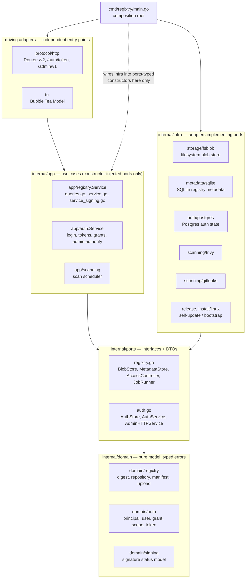
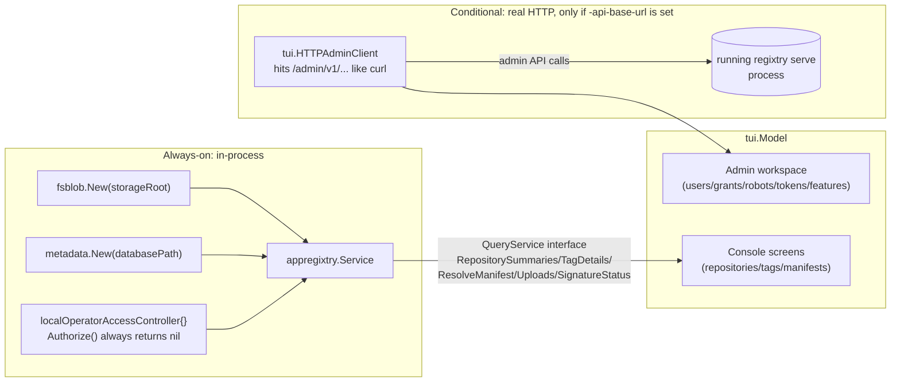
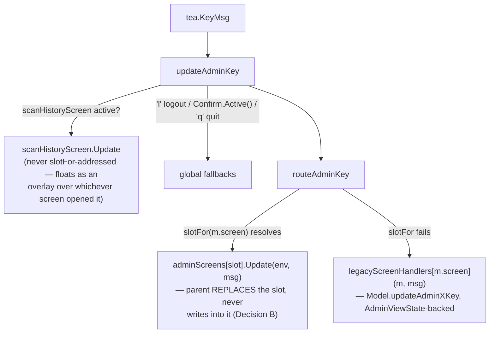

# Architecture

regixtry is a single Go binary that is, depending on the subcommand, an OCI/Docker registry server (`regixtry serve`), a Bubble Tea console (`regixtry tui`), or one-shot bootstrap/upgrade tooling. The whole codebase follows hexagonal/clean architecture: dependencies point inward, `internal/domain` knows nothing about HTTP or SQL, and `cmd/regixtry/main.go` is the only place concrete infrastructure gets wired into interfaces.

## Layer map



Arrows point in the direction of the *depends-on* relationship. `internal/infra/*` packages never import each other and never import `protocol` or `tui`. `protocol/http` and `tui` never import `infra` directly and never import each other — both only call into `app`. Only `cmd/regixtry/main.go` imports every concrete `infra` type, and it is the sole place a `ports.*` interface gets satisfied with a real implementation.

| Layer | Package(s) | Responsibility |
| --- | --- | --- |
| Domain | `internal/domain/regixtry`, `internal/domain/auth`, `internal/domain/signing` | Value objects and typed errors: digest, repository ref, manifest, upload state, principal, user, grant, scope, token. Zero imports of `internal/*` except `domain/auth` → `domain/regixtry`. |
| Ports | `internal/ports/regixtry.go`, `internal/ports/auth.go`, `internal/ports/defaults.go` | Interfaces (`BlobStore`, `MetadataStore`, `AuthStore`, `AccessController`, `AdminHTTPService`, `QueryService` consumed by the TUI, etc.) plus DTOs and default in-process implementations (`NewConfigurableAccessController`, `NewPrincipalAccessController`, `NewInlineJobRunner`). Imports only the domain packages. |
| Application | `internal/app/regixtry.Service`, `internal/app/auth.Service`, `internal/app/scanning` | Orchestration/use-cases. Constructor-injected with `ports` interfaces only — never references any `internal/infra` type. |
| Infrastructure | `internal/infra/storage/fsblob`, `internal/infra/metadata/sqlite`, `internal/infra/auth/postgres`, `internal/infra/scanning/trivy`, `internal/infra/scanning/gitleaks`, `internal/infra/release`, `internal/infra/install/linux` | Outer-ring adapters implementing `ports` interfaces. `release`/`install/linux` are self-update and bootstrap tooling — not part of the request-serving path. |
| Driving adapters | `internal/protocol/http`, `internal/tui` | Two independent entry points into `app`. Neither calls `infra` directly, neither calls the other. |
| Composition root | `cmd/regixtry/main.go` | Parses subcommands (`serve`, `tui`, `bootstrap`, `bootstrap-admin`, `setup`, `feature`, `uninstall`, `upgrade`) and is the only file that wires concrete `infra` types into `ports`-typed constructors. |

## Request lifecycle traces

### 1. Docker pull (`GET /v2/<name>/manifests/<ref>`, blob `GET`)

```
Router.handleV2 (router.go:115)
  → repository/suffix split, routes by suffix (router.go:133-178)
  → handleManifest (router.go:314) / handleBlobRead (router.go:284)
      → withPrincipal (router.go:493) — if r.auth == nil, pass through anonymously (line 494-496)
          → authenticate (router.go:510) — parses "Authorization: Bearer <token>",
            calls AuthService.VerifyAccessToken (line 530) against Postgres
      → appregixtry.Service.OpenManifest (queries.go:74) / OpenBlob (queries.go:538)
          → s.authorize(...) against the injected ports.AccessController
          → sqlite.Store.ResolveManifest (metadata) or fsblob.Store.OpenBlob (blob bytes, plain os.Open — store.go:189)
      → HTTP response with Docker-Content-Digest headers (writeBlobHeaders)
```

The decisive branch is `withPrincipal` (`internal/protocol/http/router.go:493-508`): when the router was constructed with a `nil` `ports.AuthService` (i.e. no `-auth-postgres-dsn` was configured), it returns immediately (`req, true`) and every pull is anonymous. Only when an auth service is present does `authenticate` (`router.go:510-536`) run, verifying the bearer token via `app/auth.Service.VerifyAccessToken` against Postgres. Authorization is then a second, independent check inside `appregixtry.Service` — `OpenManifest`/`OpenBlob` call `s.authorize` against whatever `ports.AccessController` the composition root chose (`configurableAccessController` for anonymous mode, `principalAccessController` once auth is enabled — see `internal/ports/defaults.go`).

### 2. Admin mutation (e.g. a repo-admin grant `PUT`)

`Router.handleAdmin` (`internal/protocol/http/admin_handlers.go:19`) implements a deliberate two-tier gate:

```go
// admin_handlers.go:39
if strings.HasPrefix(subpath, "repositories/") {
    principal, ok := r.requireAuthenticatedPrincipal(w, req)   // only proves *who*, not admin-ness
    ...
    r.handleAdminRepositoryResource(w, req, *principal, ...)   // authority decided downstream
    return
}

principal, ok := r.requireAdminPrincipal(w, req)                // every other route: global admin required
```

- `repositories/*` (line 39-46) is the **one** delegate-eligible namespace. It only checks that a bearer principal exists (`requireAuthenticatedPrincipal`, `admin_handlers.go:1202`), then defers the actual admin-vs-repo-admin decision to the service layer's `requireAdminOrRepoAdmin` (`internal/app/auth/service.go:1047-1059`), which has the repository name to check grants against — something the router-level gate never sees.
- Every other admin route (`features`, `scan-settings`, `users`, `robots`, ...) goes through the blanket `requireAdminPrincipal` (`admin_handlers.go:1217`), which hard-requires `principal.IsAdmin`.

This lets a non-global-admin user who holds a `repo-admin` grant on one repository reach `/admin/v1/repositories/{repo}/grants` without being a registry-wide admin — the only such exception in the admin surface. Mutations then go through `ports.AuthStore` into `internal/infra/auth/postgres` — a genuinely separate Postgres connection from the SQLite metadata store.

`Router.NewRouter` (`router.go:37-59`) only mounts `/admin/v1*` routes when the constructed `authService` also satisfies `ports.AdminHTTPService` (line 39-41); with no Postgres auth store, `router.admin` stays `nil` and `handleAdmin` 404s everything (`admin_handlers.go:20-23`).

### 3. TUI's dual local/HTTP nature

See [`docs/security.md`](security.md#tui-local-browsing-is-not-access-controlled--by-design) for the security implications of the local channel below — this section covers the wiring, not the access-control consequence.

`runTUI` (`cmd/regixtry/main.go:2194-2269`) wires two independent channels into the same `tui.Model`:



- **(a) Always-on, in-process.** `runTUI` directly constructs `fsblob.New` and `metadata.New` (main.go:2199-2207) and wires an `appregixtry.Service` with `localOperatorAccessController{}` (main.go:2240) — whose `Authorize` unconditionally returns `nil` (main.go:2404-2406). This is exposed to the TUI only through the narrow `tui.QueryService` interface (`internal/tui/model.go:42-48`: `RepositorySummaries`, `TagDetails`, `ResolveManifest`, `Uploads`, `SignatureStatus`). It backs the Console with **zero flags required** and **no per-user access control** — this is deliberate; local browsing through the TUI is not a security boundary.
- **(b) Conditional, real HTTP.** Only when `-api-base-url` / `REGISTRY_API_BASE_URL` is set does `runTUI` construct a `tui.HTTPAdminClient` (main.go:2226-2232, `tui.NewHTTPAdminClient` at `internal/tui/admin_client.go:87`), which issues real HTTP requests against `/admin/v1/...` exactly as `curl` would. Every admin-screen call site nil-guards this client — without the flag, admin screens are structurally unreachable, not just hidden.

Net effect: `regixtry tui` alone is a local read-only console over whatever storage root/database path it's pointed at. Pointing the same binary at a running server's admin API additionally unlocks the full admin surface over real HTTP — the TUI never talks to `infra` on the admin side, only to another process's HTTP API.

## TUI screen-ownership model

`internal/tui`'s admin workspace is built on a per-screen state-ownership primitive (`internal/tui/screen.go`), introduced to stop a class of bug where one screen's key handler silently mutated another screen's state (a shared per-repository override modal that only Trivy could open, later cycled to edit Gitleaks'/Signing's own overrides — see the `tui-menu-architecture` OpenSpec change).



- **`adminScreen` contract** (`screen.go`) — `ID() screen`, `Keys() screenKeys`, `Init(env screenEnv) tea.Cmd`, `Update(env screenEnv, msg tea.Msg) (next adminScreen, cmd tea.Cmd, consumed bool)`, `View(theme adminTheme, env screenEnv) screenFrame`. `adminScreen` is a **value-typed** interface (`Update` returns a new value, never mutates through a pointer), so `Model.adminScreens` — a fixed-size `[numScreenSlots]adminScreen` array, not a map or slice — keeps ordinary Bubble Tea value-copy semantics: copying `Model` copies the whole screen set. `screenFrame` deliberately has **no `Help` field**; the router renders every migrated screen's footer from `Keys()` via `shortHelpView`, so a screen's rendered help cannot drift from what its own `Update` actually matches against.
- **Router** (`admin_router.go` / `updateAdminKey` in `model.go`) — one screen id resolves in exactly one place: `slotFor(m.screen)` first (a migrated top-level screen), then `legacyScreenHandlers[m.screen]` (a package-level, stateless function table — the D5 adapter, holding no data of its own). `TestEveryScreenRoutesExactlyOnce`/`TestLegacyAdapterHoldsNoState` (`internal/tui/admin_router_test.go`) keep that boundary honest.
- **Legacy adapter boundary (D5 phasing)** — Identity & Access (Users, Robots, Repository Grants, Tokens) and Browse (Repositories → Tags → Manifest → Blobs/Uploads) are **deliberately not migrated**: they keep reading/writing `AdminViewState` through `legacyScreenHandlers`, unchanged, behind the same adapter every migrated screen used to sit behind before it graduated. Migrating them is a later, separate change — the adapter's whole purpose is to make that boundary a visible, reviewable line rather than an implied one.
- **Migrated screens** — every Security & Compliance screen (`securityMenuScreen`, `trivyConfigScreen`, `trivyReposScreen`, `gitleaksConfigScreen`, `signingConfigScreen`, the shared `featureOverridesScreen` behind Gitleaks'/Signing's own repository lists) and every Operations/menu screen (`adminMenuScreen`, `adminOperationsScreen`, `scanRunsScreen`, `scanHistoryScreen`) own their state as struct fields, never as `AdminViewState` siblings. `TestMigratedScreensHaveZeroFieldsOnAdminViewState` (`internal/tui/admin_view_state_migration_test.go`) asserts, by `reflect`, that no migrated screen's state field survives on `AdminViewState`.
- **`scanHistoryScreen` is the one screen not resolved via `slotFor`/`m.screen`.** It composites as a floating overlay over whichever screen opened it (`m.screen` never changes while it is mounted) — the same shape `gitleaksConfigScreen` used before it was promoted to a full top-level screen. It is reached two ways (Trivy's Repository Alerts `Enter`, and Operations' Scan Runs/Secret Scan Findings pickers' own `Enter`), tracked via its own `returnTo` field so `Esc` un-mounts it and lands back on the correct opener.
- **One confirm primitive** (`confirm.go`'s `confirmPrompt`) replaces the old `Kind`-discriminated `adminConfirmModal` union and the Tags screen's separate `PendingDelete` pattern. It is composed into a screen's own sub-model (or embedded in a legacy model like `TagsModel`) rather than living on a shared struct, so adding a new confirm never widens a god-object.
- **Domain-grouped navigation** (`screen_admin_menu.go`, `screen_operations.go`) — post-login lands on a 4-row domain menu (Browse / Security & Compliance / Identity & Access / Operations); each domain row navigates into an existing or newly migrated top-level screen. `navigate(to screen)` (a `tea.Cmd` emitting `navigateMsg`) is the one channel a migrated screen uses to ask the parent to switch `m.screen` — the parent applies the transition centrally and lazily mounts+`Init`s a target screen the first time it is visited, never writing into a sibling's fields directly.

See [`docs/tui.md`](tui.md) for the full navigation map and key-binding table.

## Storage: two separate databases

`cmd/regixtry/main.go` opens two backing stores with different lifecycles:

| Store | Constructed | Condition | Holds |
| --- | --- | --- | --- |
| SQLite metadata (`internal/infra/metadata/sqlite`) | `metadata.New(cfg.DatabasePath)` — `newHandler` (main.go:2126) and `runTUI` (main.go:2204) | **Unconditional** | Repositories, manifests, tags, manifest↔blob relations, uploads, scan-run records, feature-runtime state |
| Postgres auth (`internal/infra/auth/postgres`) | `openAuthStore(cfg.AuthPostgresDSN)` (main.go:2100-2115, and `runTUI` main.go:2214-2224) | **Conditional** — only if `-auth-postgres-dsn` / `AuthPostgresDSN` is set | Users, robots, repo grants, admin/access tokens |

If no Postgres DSN is configured, there is no auth store at all: no admin routes get mounted (`Router.NewRouter`, above), no login, and the registry runs in anonymous-access mode gated only by `AllowAnonymousPull`/`AllowAnonymousPush` (`ports.AccessConfig`, `internal/ports/defaults.go:11-16`). Blob bytes themselves never touch either database — they live under `<storage-root>/content/blobs/sha256/<digest-hex>` on the filesystem (`internal/infra/storage/fsblob/store.go`), written via a temp-then-rename upload lifecycle (`BeginUpload`/`PutUploadChunk`/`CommitUpload`, store.go:32-162).

## Feature registry

Vulnerability scanning (Trivy) and secret scanning (Gitleaks) are wired through a generic feature-registry pattern in `internal/app/regixtry` (`SetFeatureRuntimeManager`, `ListFeatures`, `GetFeaturePage`, ...) rather than being hard-coded into the router or the TUI. See `docs/features.md` for the registry contract, backend-declared admin pages, and runtime lifecycle (install/upgrade/rollback) — not duplicated here.

## Composition root

`cmd/regixtry/main.go` is the only file where a concrete `internal/infra` type is assigned to a `ports`-typed variable. The two paths that matter for request serving:

- `serve` → `newHandler` (main.go:2085-2192): builds `accessController`, optionally opens the Postgres auth store and swaps in `principalAccessController`, always opens `fsblob`/`sqlite`, wires `appregixtry.NewService`, and returns `regixtryhttp.NewRouter(service, authService)`.
- `tui` → `runTUI` (main.go:2194-2269): builds the always-on local `appregixtry.Service` plus the conditional `HTTPAdminClient`, described above.

Every other subcommand (`bootstrap`, `bootstrap-admin`, `setup`, `feature`, `uninstall`, `upgrade`) is one-shot tooling that also lives in `cmd/regixtry/main.go` and uses `internal/infra/release` / `internal/infra/install/linux` — it does not participate in the request-serving path shown above.
